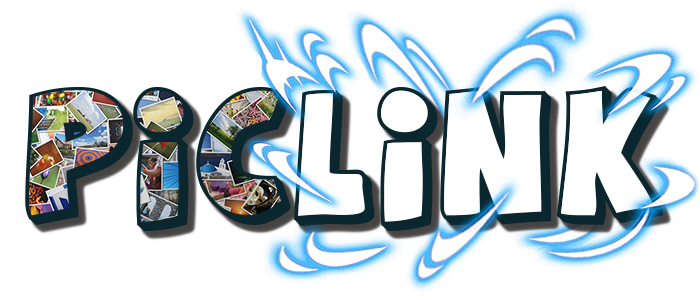

  

🎮 **PicLink** is a simple yet addictive web-based matching game built with HTML, CSS, and JavaScript.

## 🚀 How to Play

- You must link pairs of matching images.
- Complete the board as quickly as possible to achieve the highest score.
- Gain coins to custommize your profile.
- Keep track of your best times and challenge your friends!

## 🌟 Features

- **Simple and intuitive gameplay**
- **Responsive design** (works great on mobile and desktop)
- **Timer & Scoreboard** functionality
- Minimalist UI for an optimal gaming experience

## 🛠️ Technologies Used

- HTML5
- CSS
- JavaScript

## 📄 License

Distributed under the MIT License.

## 📬 Contacts

- GitHub: [Jacopo Di Stefano](https://github.com/jacdiste)
- GitHub: [Nicholas Montoni](https://github.com/NicholasMontoni)

---